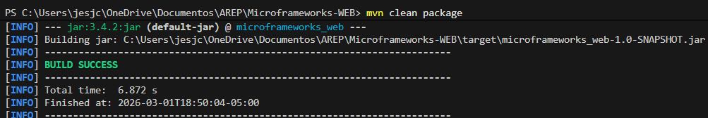
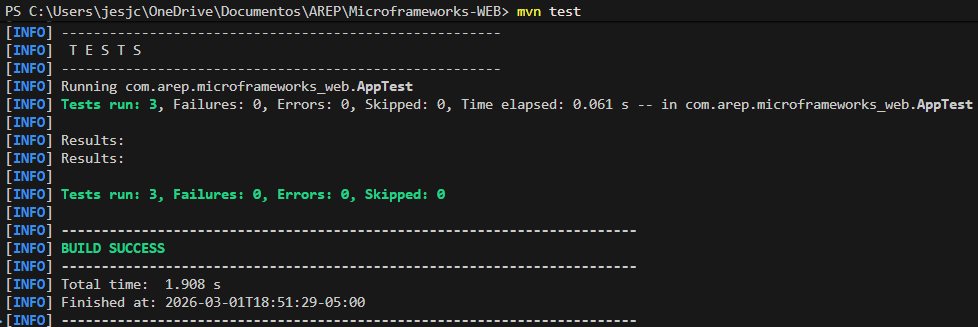
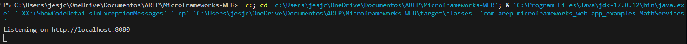
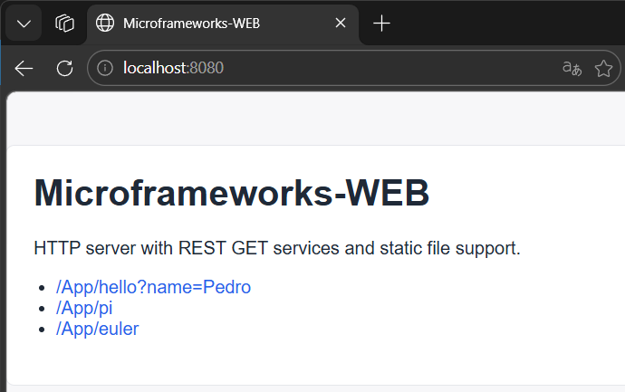
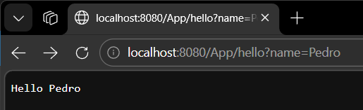
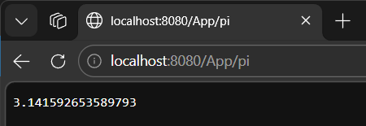

# Microframeworks-WEB

Java HTTP microframework (Maven project) that supports:

- REST service publishing through `GET` routes and lambda handlers.
- Query parameter extraction from incoming requests.
- Static file serving from a configurable folder.

## Project Goal

This project extends a basic web server into a lightweight web framework for backend REST services and static content delivery. It is designed to help developers understand HTTP protocol fundamentals and distributed web application architecture through hands-on implementation.

## Core Features

### 1) REST `GET` route registration

Define routes in a concise way:

```java
get("/hello", (req, res) -> "hello world!");
```

### 2) Query value extraction

Read query string values directly from `HttpRequest`:

```java
get("/hello", (req, res) -> "Hello " + req.getValues("name"));
```

### 3) Static files location configuration

Configure where static files are served from:

```java
staticfiles("/webroot");
```

The server resolves resources from `target/classes/webroot/...` at runtime.

## Architecture

### Main Components

- `HttpServer`
  - Opens a socket server (default port `8080`).
  - Parses HTTP request line (`method`, `path`, `query`).
  - Dispatches to registered `GET` handlers.
  - Falls back to static file resolution when no route is matched.
- `HttpRequest`
  - Encapsulates request metadata.
  - Parses and decodes query params (`UTF-8`).
  - Exposes values using `getValue(...)` and `getValues(...)`.
- `HttpResponse`
  - Encapsulates status code/text, content type, and custom headers.
- `WebMethod`
  - Functional interface used by lambda route handlers.
- `app_examples/MathServices`
  - Sample application that wires routes and starts the server.

### Request Lifecycle

1. A TCP connection is accepted.
2. The request line is parsed.
3. If method is `GET`, the route table is checked.
4. If a route exists, its lambda handler is executed.
5. If no route exists, static file lookup is attempted.
6. The server writes the HTTP response and closes the connection.

## Project Structure

```text
src/
  main/
    java/com/arep/microframeworks_web/
      HttpServer.java
      HttpRequest.java
      HttpResponse.java
      WebMethod.java
      app_examples/
        MathServices.java
      utilities/
    resources/webroot/public/
      index.html
      styles.css
  test/
    java/com/arep/microframeworks_web/
      AppTest.java
pom.xml
README.md
```

## Getting Started

### Prerequisites

- Java 17+
- Maven 3.8+

### Build

```bash
mvn clean package
```

### Run the Sample Application

```bash
java -cp target/classes com.arep.microframeworks_web.app_examples.MathServices
```

You can also run `MathServices` directly from your IDE.

## Framework Usage Example

```java
import static com.arep.microframeworks_web.HttpServer.get;
import static com.arep.microframeworks_web.HttpServer.staticfiles;

public class MyApp {
    public static void main(String[] args) throws Exception {
        staticfiles("/webroot");

        get("/App/hello", (req, resp) -> "Hello " + req.getValues("name"));
        get("/App/pi", (req, resp) -> String.valueOf(Math.PI));

        com.arep.microframeworks_web.HttpServer.main(args);
    }
}
```

## Available Sample Endpoints

- `http://localhost:8080/App/hello?name=Pedro`
- `http://localhost:8080/App/pi`
- `http://localhost:8080/App/euler`
- `http://localhost:8080/index.html`

## Test Strategy and Results

Unit tests in `AppTest` validate:

1. Query parameter parsing and decoding (`HttpRequest`).
2. Route registration and lambda execution (`HttpServer.get`).
3. Static files directory configuration (`HttpServer.staticfiles`).

Run tests with:

```bash
mvn test
```

Latest local result:

```text
Tests run: 3, Failures: 0, Errors: 0
```

## Manual Functional Validation

With server running locally:

```text
GET /App/hello?name=Pedro -> Hello Pedro
GET /App/pi -> 3.141592653589793
GET /index.html -> STATUS=200
```

## Evidence (Screenshots)

Add your screenshots in `docs/evidence/` and keep the same names below for clean rendering in GitHub.

### Suggested Evidence Checklist

1. Build success in terminal (`mvn clean package`)
2. Test success in terminal (`mvn test`)
3. Running server console (`Listening on http://localhost:8080`)
4. Browser/API call for `/App/hello?name=Pedro`
5. Browser/API call for `/App/pi`
6. Browser rendering of `/index.html`

### Evidences












